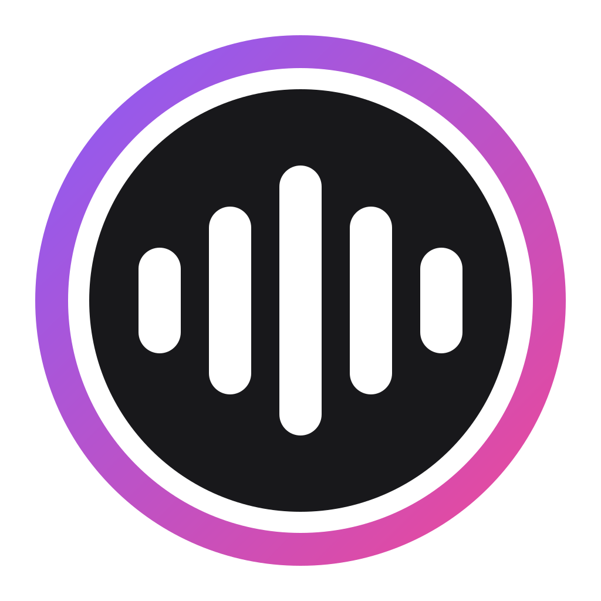

<p align="center">
  
</p>

<h1 align="center">Yapora</h1>

<p align="center">
  <em>yap + aura</em> — a reactive avatar for streams and videos
</p>

<p align="center">
  
  
</p>

<p align="center">
  <a href="#install">Install</a> ·
  <a href="#quickstart">Quickstart</a> ·
  <a href="#using-it">Using it</a> ·
  <a href="#development">Development</a>
</p>

Turn any image into an audio-reactive avatar.
Choose your frame shape, add a halo that pulses with your voice, and drag a spectrum-analyzer "mouth" right into place.
Stream it live directly to OBS, or drop in an audio file to render a finished video.

<div align="center">
  
[Yapora Sample.webm](https://github.com/user-attachments/assets/26cfe857-c15f-4745-8428-a7dc785301e6)

</div>

## Install

Build the installer with `pnpm app:build` (see [Development](#development)) and
run `src-tauri/target/release/bundle/nsis/Yapora_<version>_x64-setup.exe`.

It isn't code-signed, so Windows SmartScreen warns the first time: **More info
→ Run anyway**. Settings, profiles and images live in `%APPDATA%\com.yapora`.

## Quickstart

Open Yapora, upload an image, crop it, and position the mouth. Settings save as
you go. Then add an OBS **Browser Source**:

- URL `http://localhost:4173/?mode=live` — **Output → OBS** has a copy button.
- A square size, e.g. 1000 × 1000, with the background left transparent.

OBS needs no launch flags or microphone permission: Yapora reads the mic itself
and streams to the source. Keep Yapora open while you stream; OBS picks it up
whenever it starts, and edits show up live.

## Using it

**Profiles** keep separate looks — switch from the dropdown on the stage or the
**Profile** tab, where you also create, duplicate, delete, export and import
them. OBS shows the active profile. The microphone and playback device are
shared by all profiles; everything else is per profile.

**Tuning** comes down to two sliders in the **Audio** tab, drawn on its level
meter: set the **noise gate** just above where the meter sits when you're
silent, and the **ceiling** near your normal speaking peaks.

**Sources** — the avatar can follow the **microphone**, a speech-shaped **test
signal**, or an **audio file** (WAV, MP3, FLAC, OGG, M4A/AAC, AIFF, CAF) played
through a chosen playback device, with a player on the stage to play, pause
(`Space`) and scrub.

**Videos** — with an audio file loaded, **Output → Video** exports it with your
look: square, 16:9 or 9:16, 30 or 60 fps, MP4 or WebM (only formats your
machine can encode are offered). It renders frame by frame, so it never drops
frames and stays in sync. Exports aren't transparent yet: a transparent
background exports as green screen.

**Keyboard** — `Ctrl`/`⌘` + `E` toggles Live mode and `Esc` leaves it. With
the mouth selected, arrow keys nudge it (`Shift` for 10), and `Shift` + dragging
a corner keeps its proportions.

## Troubleshooting

**The avatar doesn't move.** The **Audio** tab names the problem — mic access
blocked in Windows privacy settings, no mic, mic in use by another app, or
disconnected. A saved device that's missing falls back to the system default.

**"Could not serve OBS on port 4173".** Another copy of Yapora is running —
often the dev app alongside the installed one.

**The OBS source is black.** Check the URL ends in `?mode=live`. OBS 28–30
browse with Chromium 103 (OBS 31 moved to 127); the installed app's build
supports it, but the dev server doesn't.

## Development

```bash
pnpm install
pnpm app
```

`pnpm app` runs the app against Vite with hot reload; Rust changes rebuild and
restart it. The first build takes a few minutes. `pnpm app:build` makes the
release build and installers. `cargo test` in `src-tauri/` covers the audio
analysis, file playback and export analysis.

How it fits together:

- **Rust** (`src-tauri/`) captures and plays audio, runs the FFT at 60 Hz,
  stores profiles on disk, and serves OBS from `127.0.0.1:4173`.
- **The page** (`src/`) is the same bundle in the app window and in OBS. The
  window talks to Rust over IPC; OBS only reads, over HTTP and a WebSocket.
- **Gain, gate and smoothing** are applied by `Reaction`
  (`src/audio/reaction.ts`), shared by the live stage and video export, so both
  react the same way.
- **The stage is SVG** for live use, and **redrawn with Canvas 2D** for export
  (`src/export/StageCanvas.ts`) from the same geometry — change one, change the
  other.
- **Profiles are versioned** (`src/store/schema.ts`); `migrateProfile` upgrades
  old ones, so add a step when a field changes meaning.

**Releasing:** bump the version in `src-tauri/tauri.conf.json`,
`package.json` and `src-tauri/Cargo.toml`, then `pnpm app:build`.

**The logo** is `src-tauri/app-icon.svg` (copied to `public/icon.svg` as the
favicon). Regenerate the app icons with `pnpm tauri icon src-tauri/app-icon.svg`
and delete the `android/` and `ios/` folders it creates.

### Ideas

- Avatar motion (**Stage → Avatar motion**) moves only the avatar, not the
  mouth or halo, so the mouth drifts off the face with bounce turned up.
- Transparent WebM export: Chromium's WebCodecs encodes VP9 with alpha and
  mediabunny supports it (`alpha: "keep"`); the export renderer would just
  need to stop filling the background. MP4 (H.264) can't carry alpha.
- Record the mic to a file, to export straight from a recording.
- A tray icon, so closing the window doesn't stop OBS's feed.
